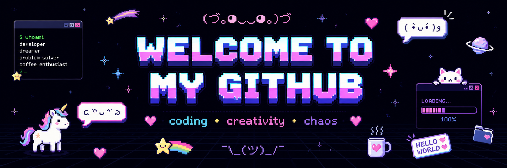

  

<h1 align="center">Hi, I'm Zhansaya 👋 \n You can call me just Saya</h1>

  Aspiring Sofware engineer | Creative Developer

---

## (👉ﾟヮﾟ)👉 About Me

I am learning programming and building creative projects.  
I enjoy combining technology, design, and real-life problem solving.

---

## ᓚᘏᗢ Featured Project

### 🌊 WaveWare — Beach Shop Simulation

WaveWare is a Python console application that simulates a beach shop experience.  
Users can browse products, add items to a cart, and receive a structured receipt.

---

## (⌐■_■) Tech Stack

  

---

## (☆▽☆) Current Goals

- Build more real projects
- Learn GitHub professionally
- Create beautiful and useful applications

---

  <b>Thanks for visiting my profile! ✨</b>

